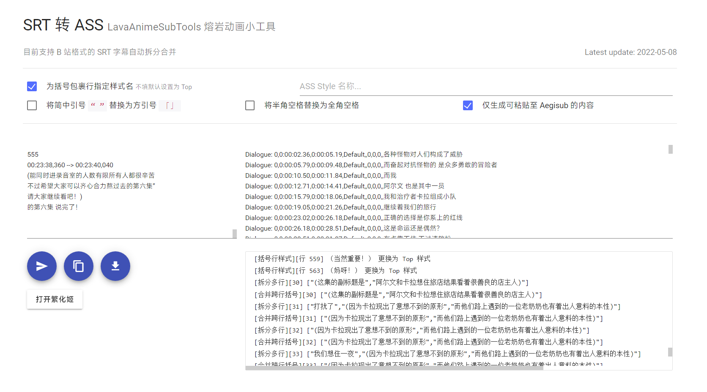

# LavaAnimeSubToolsWeb

熔岩动画的一些字幕工具...

目前仅有一个功能，SRT 转 ASS，此处的 SRT 一般是从 ASS 转过来的丢失样式的 SRT 分裂字幕，通过此工具可以把它变得有点样式。

[在线使用](https://tools.lavaanime.top)



## SRT 转 ASS

支持以下类型的 SRT 整理。（下方的 SRT 已隐去行号）

### 将跨行出现的对话合并，并将括号行指定样式

```
00:03:28,380 --> 00:03:32,540
（小时候描绘的梦想）
00:03:32,540 --> 00:03:33,770
这首歌是…
（小时候描绘的梦想）
00:03:33,770 --> 00:03:35,120
（小时候描绘的梦想）
```

```
<!-- 括号行被指定了样式 -->
Dialogue: 0,0:03:28.38,0:03:35.12,Top,,0,0,0,,（小时候描绘的梦想）
Dialogue: 0,0:03:32.54,0:03:33.77,Default,,0,0,0,,这首歌是…
```

### 整理多重对话为多个字幕

```
00:03:08,370 --> 00:03:12,470
-说起来 还真是好久没来过俱乐部了 -当年很红的 大家多半听过

00:10:31,690 --> 00:10:32,630
-圣人以天为则
00:10:32,630 --> 00:10:33,760
-圣人以天为则
-我刚才好像看见什么
```

```
Dialogue: 0,0:03:08.37,0:03:12.47,Default,,0,0,0,,当年很红的 大家多半听过
Dialogue: 0,0:03:08.37,0:03:12.47,Default,,0,0,0,,说起来 还真是好久没来过俱乐部了

Dialogue: 0,0:10:31.69,0:10:33.76,Default,,0,0,0,,圣人以天为则
Dialogue: 0,0:10:32.63,0:10:34.63,Default,,0,0,0,,我刚才好像看见什么
```

### 包括这种复杂的

```
00:01:59,250 --> 00:02:00,540
(两人发现这世界上有时四处都是化为人形的魔物和怪物)
00:02:00,540 --> 00:02:02,900
(“请住下吧！布林！”来源于池田多惠子
漫画作品的标题《飞天少女猪》。)
欢迎来到“请住下吧！布林！”
(两人发现这世界上有时四处都是化为人形的魔物和怪物)
```

```
Dialogue: 0,0:01:59.25,0:02:02.90,Top,,0,0,0,,(两人发现这世界上有时四处都是化为人形的魔物和怪物)
<!-- 跨行括号会在ASS内保留注释 -->
Comment: 0,0:02:00.54,0:02:02.90,Default,,0,0,0,,(“请住下吧！布林！”来源于池田多惠子
Comment: 0,0:02:00.54,0:02:02.90,Default,,0,0,0,,漫画作品的标题《飞天少女猪》。)
Dialogue: 0,0:02:00.54,0:02:02.90,Top,,0,0,0,,(“请住下吧！布林！”来源于池田多惠子漫画作品的标题《飞天少女猪》。)
Dialogue: 0,0:02:00.54,0:02:02.90,Default,,0,0,0,,欢迎来到“请住下吧！布林！”
```
